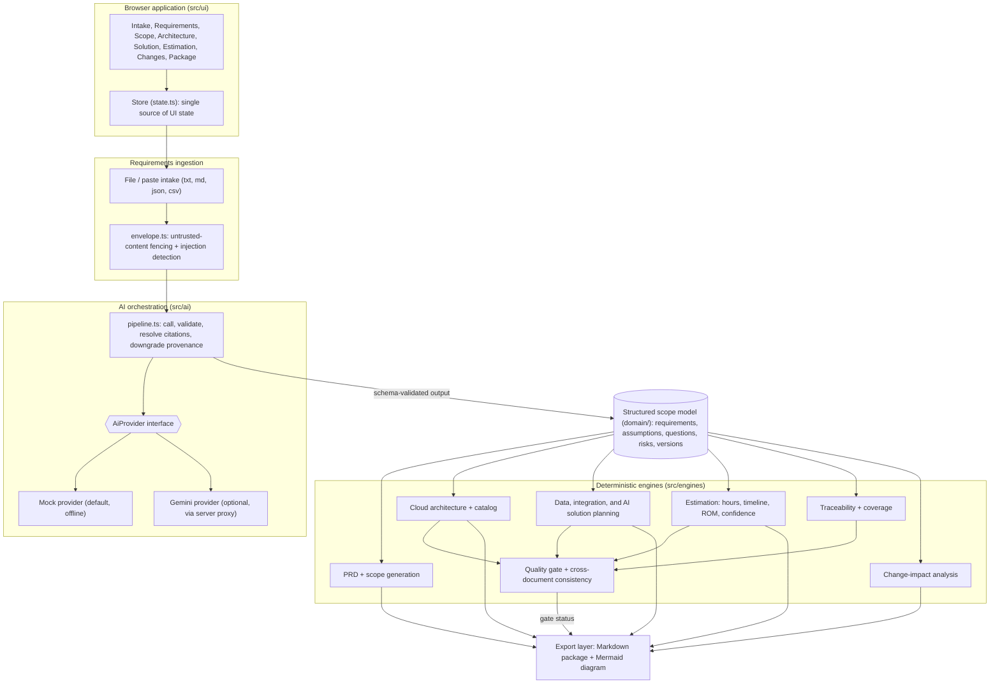

# Deal Scoping Assistant

Deal Scoping Assistant is a TypeScript-based deal-scoping workspace for turning raw customer material into a traceable, validated, and decision-ready scope model. It helps pre-sales and solution teams ingest requirements, resolve ambiguity, preserve provenance, and generate deterministic estimates without mistaking AI output for customer fact.

The product is designed for one specific problem: ensuring AI-assisted scoping remains auditable, reviewable, and grounded in source material before it is used in a proposal or estimate.

## Why this project exists

AI-generated scoping content is often treated as if it were customer truth. This project prevents that failure pattern by separating:

- customer-supplied statements from AI-generated interpretation
- source-backed requirements from inferred assumptions
- deterministic estimation logic from provider-suggested numbers
- change impact from silent artifact regeneration

### Core principles

- One source of truth: the scope model drives PRD, architecture, data strategy, integration design, AI strategy, and estimation.
- Provenance-first records: every derived item carries explicit provenance and review status.
- Customer statements are earned: a requirement must be re-linked to source text before being labeled as customer-stated.
- AI does not compute estimate numbers: provider output may suggest a band or rationale, but the actual hours, rate, and cost are computed via deterministic rules.
- Change impact is explicit: downstream artifacts are updated through defined rules rather than silently regenerated.
- Quality is enforced by the same validator used in the domain layer, preventing mismatched downstream checks.

## Product overview

The app guides a full scoping workflow:

1. Intake customer material from pasted text, Markdown, JSON, CSV, or bundled source documents.
2. Extract and review requirements with provenance and citations.
3. Resolve clarifying questions and approve the model.
4. Generate scope items, capabilities, and PRD content.
5. Choose or accept a cloud recommendation.
6. Produce architecture, integration, AI, and data strategy artifacts.
7. Review deterministic estimation inputs and outputs.
8. Track stale artifacts and change impact.
9. Run the quality gate and export the package.

This is a static web application rather than a backend service. It renders the complete deal-scoping workspace directly in the browser and packages the final output as a self-contained HTML bundle.

## Key capabilities

### Requirement intake and validation

- Accepts raw text and structured input.
- Normalizes and preserves original source excerpts.
- Tracks source spans, citations, and source checksums.
- Flags requirements that are not sufficiently grounded in customer material.

### Provenance-aware scope modeling

The domain layer models requirements, assumptions, risks, questions, capabilities, and scope items with provenance and review status fields. This keeps AI-generated content visibly distinct from customer-passed language and makes approval and review explicit before a scope model becomes a proposal artifact.

### Deterministic estimation engine

- Computes estimates using fixed domain rules rather than AI-supplied values.
- Accepts configuration inputs such as cloud, scale, compliance, user counts, concurrency tier, and productivity factors.
- Produces ROM estimate, role-based effort, critical-path timeline, and confidence score.
- Rejects provider responses that attempt to inject numeric fields like hours, cost, price, or days.

### Change-impact analysis

The workspace previews the effect of edits before regeneration. It identifies stale artifacts, review items, and the artifacts that should or should not be regenerated.

### Quality gate and export package

- Exposes quality gate states: READY, REVIEW_REQUIRED, and BLOCKED.
- Exports a canonical Markdown package and Mermaid diagram.
- Keeps the project disclaimer and traceability requirements attached to the exported deliverables.

## Architecture at a glance

The codebase is organized into a few well-defined layers:

- Domain layer: schema, entities, validation, provenance, versioning
- AI layer: provider abstraction, pipeline safety, citation handling
- Engine layer: estimation, coverage, impact rules, quality gate, PRD generation
- Export layer: Markdown package generation and artifact packaging
- UI layer: route-based workspace screens and interactive state management

### Repository layout

```text
src/
  ai/
    artifact-helpers.ts
    citation-resolver.ts
    envelope.ts
    gemini-provider.ts
    mock-provider.ts
    pipeline.ts
    provider.ts
  data/
    repository.ts
    scenarios.ts
    seed.ts
  domain/
    artifacts.ts
    entities.ts
    ids.ts
    index.ts
    provenance.ts
    schema.ts
    validate.ts
    versioning.ts
  engines/
    cloud-catalog.ts
    consistency.ts
    coverage.ts
    estimation.ts
    impact-rules.ts
    impact.ts
    prd.ts
    quality-gate.ts
    rates.ts
  export/
    markdown.ts
    package-model.ts
  styles/
    app.css
    tokens.css
  ui/
    app.ts
    dom.ts
    main.ts
    state.ts
    components/
    views/

tests/
  ai-safety.test.ts
  coverage.test.ts
  estimation.test.ts
  export.test.ts
  ids.test.ts
  impact.test.ts
  quality-gate.test.ts
  repository.test.ts
  scenarios.test.ts
  schema.test.ts
  versioning.test.ts

scripts/
  build.ts
  dev.ts
  export-seed.ts
  serve.js
  test.ts
```

## Technology stack

- TypeScript
- Node.js 20+
- Vitest
- TypeScript compiler for checks and validation
- Custom build and bundling pipeline
- Browser-rendered single-page UI

## Getting started

### Prerequisites

- Node.js 20 or newer
- npm

### Install dependencies

```bash
npm install
```

### Start the app locally

```bash
npm run dev
```

This builds the app and serves it locally at:

```text
http://localhost:5173
```

### Production build

```bash
npm run build
```

This generates a self-contained HTML bundle in the `dist/` directory.

### Serve the built output

```bash
npm start
```

This serves the current `dist/` bundle through the local Node HTTP server.

### Open the built bundle directly

You can also open `dist/index.html` directly in a browser. The HTML bundle is self-contained and includes inline CSS; it does not require a backend runtime to render the UI.

## Available scripts

```bash
npm run typecheck   # Type-check TypeScript without emitting output
npm run test        # Run the project test suite
npm run test:vitest # Run Vitest directly
npm run lint        # Strict TypeScript checks (unused code, fallthrough)
npm run build       # Compile and bundle the app
npm run dev         # Build and serve the app locally
npm start           # Serve the current dist bundle
npm run verify      # Run typecheck, tests, and build
```

## Typical workflow in the app

The application is organized into route-based screens that align with a compliant proposal workflow:

1. Intake
   - upload or paste customer material
   - monitor source documents and content integrity

2. Requirements
   - review extracted requirements
   - resolve blocking questions
   - approve the scope model

3. Scope & PRD
   - derive capabilities and functional scope
   - assemble PRD narrative and traceability links

4. Architecture
   - choose a cloud provider or accept the recommendation
   - generate architecture artifacts from provider service catalogues

5. Solution design
   - inspect data strategy, integrations, AI strategy, and supporting architecture

6. Estimation
   - review workstreams and deterministic cost calculations
   - inspect the factors that drove the estimate

7. Changes
   - detect stale artifacts and preview change impact

8. Quality & export
   - validate model health
   - review gate status
   - export the final Markdown package and diagram

## Seed scenario

The project includes a Northwind Logistics demo scenario designed to surface the edge cases this tool is meant to catch:

- contradictory statements across source documents
- explicit exclusions
- regulatory retention requirements
- a planted prompt-injection attempt
- a change-sensitive architecture and estimate

From the intake screen, click “Load seeded scenario” to explore the end-to-end workflow.

## Safety and governance model

A critical part of this project is its guardrail design. The AI pipeline is intentionally constrained so dangerous output cannot pass through unchecked.

Examples of the safety rules in implementation:

- provider-generated estimate fields are rejected before they can reach the domain model
- customer-stated requirements require source-span validation
- unresolved blocking questions prevent approval
- quality gate checks are computed from the same validator used in the domain layer
- stale artifacts are explicitly flagged when the scope model changes

This keeps the tool aligned with its product goal: AI supports scoping, but does not replace review and validation.

## Testing strategy

The repository includes tests for core safety and correctness, including:

- AI safety gate enforcement
- coverage mapping and scope validation
- estimation logic
- export and package behavior
- ID generation, schema consistency, versioning, and change impact expectations

Run the suite with:

```bash
npm run test
```

Or run the full verification workflow:

```bash
npm run verify
```

## Quality gate behavior

The application exposes a quality gate with three core states:

- READY — the model is coherent and ready for export
- REVIEW_REQUIRED — the model has warnings or minor issues
- BLOCKED — the model is not ready because prerequisites are missing or invalid

This gate is not a separate validation layer. It renders and extends the same validation logic already used in the domain model.

## Production architecture diagram



The same diagram is in [docs/architecture.md](docs/architecture.md).

## Summary

Deal Scoping Assistant is a focused decision-support tool for pre-sales scoping. It blends AI-assisted extraction with strict traceability, quality controls, and deterministic estimation so teams can reason about scope with confidence instead of accepting unchecked AI output as formal requirement truth.
