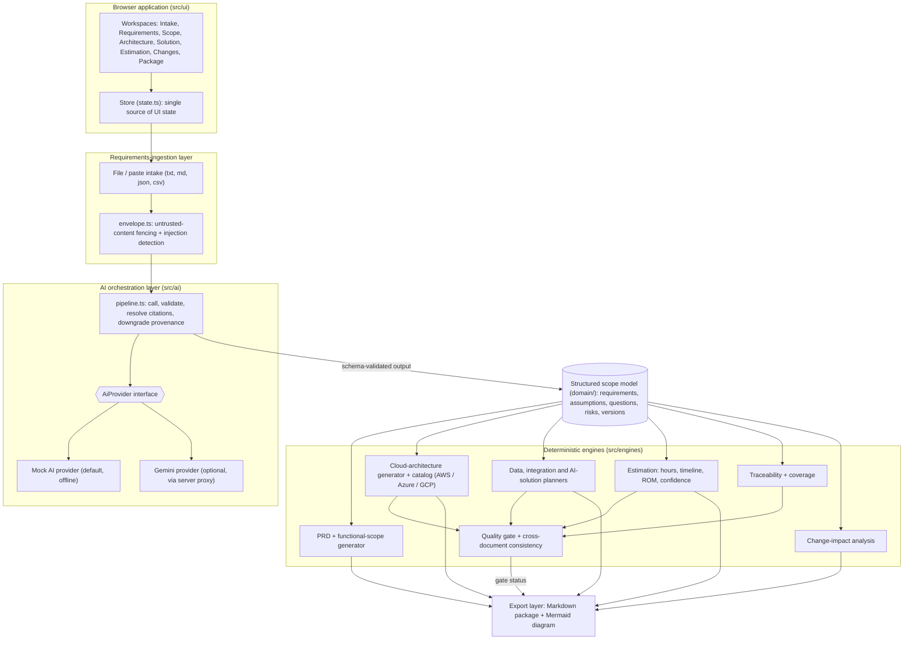

# Deal Scoping Assistant

Deal Scoping Assistant is a TypeScript-based pre-sales scoping workspace for turning raw customer material into a validated, traceable deal model. The application helps teams ingest customer requirements, resolve ambiguities, build a scope model, derive downstream artifacts, and produce a deterministic ROM estimate without treating AI output as customer fact.

The project is designed for a very specific problem: ensuring AI-generated scoping content is clearly separated from customer statements, reviewable, and auditable before it is used in a proposal or estimate.

## Why this project exists

This tool exists to prevent a common failure mode in AI-assisted scoping: an AI guess being mistaken for a customer commitment.

Core design principles in this codebase:

- One source of truth: the scope model drives PRD, architecture, data strategy, integration design, AI strategy, and estimation.
- Provenance-first records: every derived item carries provenance, not just text.
- Customer statements are earned: a requirement must be re-linked to source text before being labeled as customer-stated.
- AI never computes estimate numbers: provider output may suggest a band or rationale, but the actual hours, rate, and cost are computed deterministically from domain rules.
- Change impact is explicit: downstream artifacts are updated through defined rules rather than silently regenerated.
- Quality is enforced by the same validator used in the domain layer, preventing mismatched downstream checks.

## Product overview

The application walks through a full scoping workflow:

1. Intake customer material from pasted text, Markdown, JSON, CSV, or bundled source documents.
2. Extract and review requirements with provenance and citations.
3. Resolve clarifying questions and approve the model.
4. Generate scope items, capabilities, and PRD content.
5. Choose a cloud provider or use recommendations.
6. Produce architecture, integration, AI, and data strategy artifacts.
7. Review deterministic estimation inputs and outputs.
8. Track changes and stale artifacts.
9. Run the quality gate and export the package.

This is a static web application rather than a backend service. It renders a complete deal-scoping workspace directly in the browser and packages the final output as self-contained HTML.

## Key features

### Requirement intake and validation

- Supports raw text and structured inputs.
- Normalizes source documents and preserves original source excerpts.
- Tracks source spans, citations, and source checksums.
- Flags when a requirement is not truly grounded in customer material.

### Provenance-aware scope modeling

The domain layer models requirements, assumptions, risks, questions, capabilities, and scope items with provenance and review status fields. This keeps AI-generated content visibly distinct from customer-passed language and makes it easier to review and approve a scope model before it becomes a proposal artifact.

### Deterministic estimation engine

- Estimates are computed using fixed rules rather than AI-supplied numbers.
- Accepts configuration inputs such as cloud, scale, compliance, user counts, concurrency tier, and productivity factors.
- Produces a ROM estimate, role-based effort, critical-path timeline, and confidence score.
- The pipeline blocks provider responses from injecting fields like hours, cost, price, or days.

### Change-impact analysis

The workspace includes a staged change model that previews the impact of edits before regeneration. It identifies what is stale, what needs review, and which artifacts should be regenerated or left intact.

### Quality gate and export package

- Quality gate status is READY, REVIEW_REQUIRED, or BLOCKED.
- A package export includes the canonical Markdown artifact and a Mermaid diagram.
- Every exported deliverable can carry the project’s required disclaimer.

## Architecture at a glance

The project is organized into a few distinct layers:

- Domain layer: schema, entities, validation, provenance, versioning
- AI layer: provider abstraction, pipeline safety, citation handling
- Engine layer: estimation, coverage, impact rules, quality gate, PRD generation
- Export layer: Markdown package generation and artifact packaging
- UI layer: route-based workspace screens and interactive state management

### Main directories

```text
src/
  ai/
    gemini-provider.ts
    mock-provider.ts
    pipeline.ts
    provider.ts
    citation-resolver.ts
    artifact-helpers.ts
    envelope.ts
  data/
    repository.ts
    seed.ts
    scenarios.ts        # four demo scenarios
  domain/
    artifacts.ts
    entities.ts
    ids.ts
    index.ts
    provenance.ts
    schema.ts
    validate.ts
    versioning.ts
  engines/
    cloud-catalog.ts
    consistency.ts      # cross-document checks
    coverage.ts
    estimation.ts
    impact-rules.ts
    impact.ts
    prd.ts
    quality-gate.ts
    rates.ts
  export/
    markdown.ts
    package-model.ts
  styles/
    app.css
    tokens.css
  ui/
    app.ts
    dom.ts
    main.ts
    state.ts
    components/
    views/

tests/
  ai-safety.test.ts
  coverage.test.ts
  estimation.test.ts
  export.test.ts
  ids.test.ts
  scenarios.test.ts
  impact.test.ts
  quality-gate.test.ts
  repository.test.ts
  schema.test.ts
  versioning.test.ts

scripts/
  build.ts
  dev.ts
  export-seed.ts
  serve.js
  test.ts
```

## Technology stack

- TypeScript
- Node.js 20+
- Vitest for tests
- ESLint for linting
- Custom TypeScript build and bundling pipeline
- Browser-rendered single-page UI

## Getting started

### Prerequisites

- Node.js 20 or newer
- npm

### Install dependencies

```bash
npm install
```

### Run the app locally

Build the bundle and serve it locally:

```bash
npm run dev
```

This runs the build step and starts the local server at:

```text
http://localhost:5173
```

### Production-style build

```bash
npm run build
```

This generates a self-contained HTML package in the `dist/` folder.

### Start the static server

```bash
npm start
```

This serves the built files from `dist/` using the local Node HTTP server.

### Open built output directly

You can also open `dist/index.html` directly in a browser. The result is a fully self-contained UI bundle with inline CSS and no external JS runtime dependencies beyond the Google Fonts declared in the HTML head, which fall back gracefully when unavailable.

## Available scripts

```bash
npm run typecheck   # Type-check TypeScript without emitting output
npm run test        # Run the project’s test suite
npm run test:vitest # Run vitest directly
npm run lint        # Strict TypeScript checks (unused code, fallthrough)
npm run build        # Compile and bundle the app
npm run dev         # Build and serve the app locally
npm start           # Serve the current dist bundle
npm run verify      # Run typecheck, tests, and build
```

## Workflow in the app

The app is organized into route-based screens that follow a compliant proposal workflow:

1. Intake
   - upload or paste customer material
   - monitor source documents and content integrity

2. Requirements
   - review extracted requirements
   - resolve blocking questions
   - approve scope model

3. Scope & PRD
   - derive capabilities and functional scope
   - assemble PRD narrative and traceability links

4. Architecture
   - pick a cloud provider or accept a recommendation
   - generate architecture artifacts from provider-specific service catalogues

5. Solution design
   - inspect data strategy, integrations, AI strategy, and supporting architecture

6. Estimation
   - review workstreams and deterministic cost calculations
   - inspect the factors that drove the estimate

7. Changes
   - detect stale artifacts and preview impact of edits

8. Quality & export
   - validate model health
   - review gate status
   - export the final Markdown package and diagram

## Seed scenario

The project includes a built-in Northwind Logistics scenario designed to demonstrate the common edge cases this tool is meant to catch:

- contradictory statements across source documents
- explicit exclusions
- regulatory retention requirements
- a planted prompt-injection attempt
- a change-sensitive architecture and estimate

From the intake screen, click “Load seeded scenario” to walk through the full workflow.

## Safety and governance model

A critical part of this project is its guardrail design. The AI pipeline is intentionally constrained so that dangerous output cannot pass through unchecked.

Examples of the safety rules in the implementation:

- provider-generated estimate fields are rejected before they can reach the domain model
- customer-stated requirements require source-span validation
- unresolved blocking questions prevent approval
- quality gate checks are computed from the same validator used by the domain layer
- stale artifacts are explicitly flagged when the scope model changes

This keeps the tool aligned with its product goal: AI supports scoping, but does not replace review and validation.

## Testing strategy

The repository includes tests for core safety and correctness, including:

- AI safety gate enforcement
- coverage mapping and scope validation
- estimation logic
- export and package behavior
- IDs, schema consistency, versioning, and change impact expectations

Run the suite with:

```bash
npm run test
```

or the full verification check:

```bash
npm run verify
```

## Quality gate behavior

The application exposes a quality gate with three core statuses:

- READY — the model is coherent and ready for export
- REVIEW_REQUIRED — the model has warnings or minor issues
- BLOCKED — the model is not ready because of missing or broken prerequisites

This gate is not a separate implementation of domain validation. It renders and extends the same validation logic already used in the model layer.

## Summary

Deal Scoping Assistant is a focused decision-support tool for pre-sales scoping. It blends AI-assisted extraction with strict traceability, quality controls, and deterministic estimation so that deal teams can reason about scope with confidence and clarity instead of accepting unchecked AI output as formal requirement truth.

## Submission architecture diagram



(The same diagram is in `docs/architecture.md`.)
