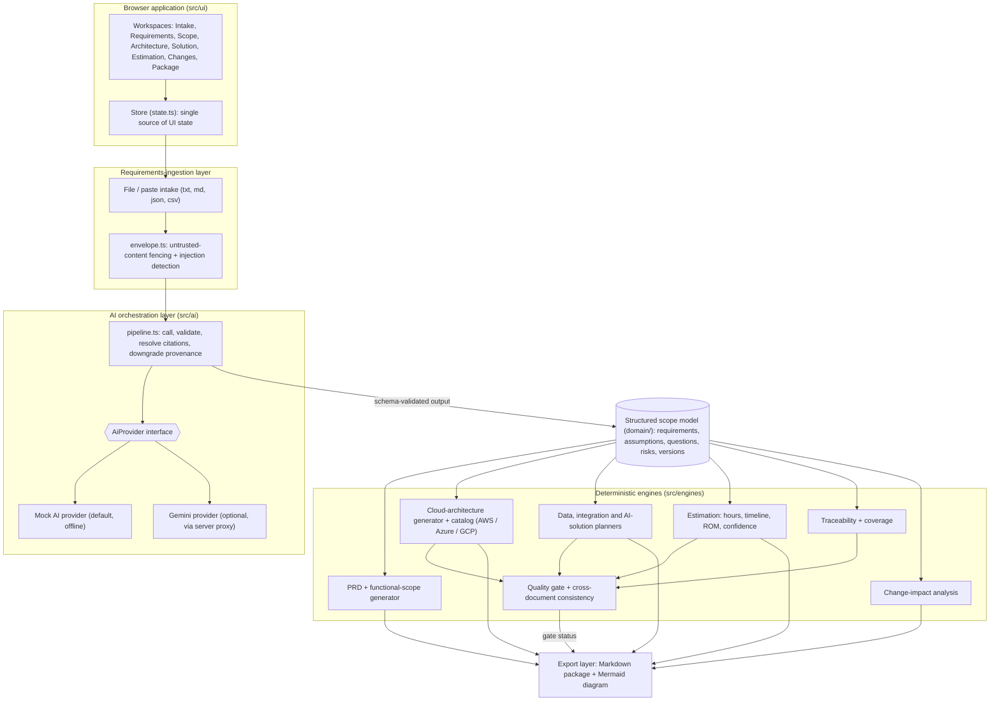

# Deal Scoping Assistant

Deal Scoping Assistant is a TypeScript-based pre-sales scoping workspace for turning raw customer material into a validated, traceable deal model. The application helps teams ingest customer requirements, resolve ambiguities, build a scope model, derive downstream artifacts, and produce a deterministic ROM estimate without treating AI output as customer fact.

The project is designed for a very specific problem: ensuring AI-generated scoping content is clearly separated from customer statements, reviewable, and auditable before it is used in a proposal or estimate.

## Why this project exists

This tool exists to prevent a common failure mode in AI-assisted scoping: an AI guess being mistaken for a customer commitment.

Core design principles in this codebase:

- One source of truth: the scope model drives PRD, architecture, data strategy, integration design, AI strategy, and estimation.
- Provenance-first records: every derived item carries provenance, not just text.
- Customer statements are earned: a requirement must be re-linked to source text before being labeled as customer-stated.
- AI never computes estimate numbers: provider output may suggest a band or rationale, but the actual hours, rate, and cost are computed deterministically from domain rules.
- Change impact is explicit: downstream artifacts are updated through defined rules rather than silently regenerated.
- Quality is enforced by the same validator used in the domain layer, preventing mismatched downstream checks.

## Product overview

The application walks through a full scoping workflow:

1. Intake customer material from pasted text, Markdown, JSON, CSV, or bundled source documents.
2. Extract and review requirements with provenance and citations.
3. Resolve clarifying questions and approve the model.
4. Generate scope items, capabilities, and PRD content.
5. Choose a cloud provider or use recommendations.
6. Produce architecture, integration, AI, and data strategy artifacts.
7. Review deterministic estimation inputs and outputs.
8. Track changes and stale artifacts.
9. Run the quality gate and export the package.

This is a static web application rather than a backend service. It renders a complete deal-scoping workspace directly in the browser and packages the final output as self-contained HTML.

## Key features

### Requirement intake and validation

- Supports raw text and structured inputs.
- Normalizes source documents and preserves original source excerpts.
- Tracks source spans, citations, and source checksums.
- Flags when a requirement is not truly grounded in customer material.

### Provenance-aware scope modeling

The domain layer models requirements, assumptions, risks, questions, capabilities, and scope items with provenance and review status fields. This keeps AI-generated content visibly distinct from customer-passed language and makes it easier to review and approve a scope model before it becomes a proposal artifact.

### Deterministic estimation engine

- Estimates are computed using fixed rules rather than AI-supplied numbers.
- Accepts configuration inputs such as cloud, scale, compliance, user counts, concurrency tier, and productivity factors.
- Produces a ROM estimate, role-based effort, critical-path timeline, and confidence score.
- The pipeline blocks provider responses from injecting fields like hours, cost, price, or days.

### Change-impact analysis

The workspace includes a staged change model that previews the impact of edits before regeneration. It identifies what is stale, what needs review, and which artifacts should be regenerated or left intact.

### Quality gate and export package

- Quality gate status is READY, REVIEW_REQUIRED, or BLOCKED.
- A package export includes the canonical Markdown artifact and a Mermaid diagram.
- Every exported deliverable can carry the project’s required disclaimer.

## Architecture at a glance

The project is organized into a few distinct layers:

- Domain layer: schema, entities, validation, provenance, versioning
- AI layer: provider abstraction, pipeline safety, citation handling
- Engine layer: estimation, coverage, impact rules, quality gate, PRD generation
- Export layer: Markdown package generation and artifact packaging
- UI layer: route-based workspace screens and interactive state management

### Main directories

```text
src/
  ai/
    gemini-provider.ts
    mock-provider.ts
    pipeline.ts
    provider.ts
    citation-resolver.ts
    artifact-helpers.ts
    envelope.ts
  data/
    repository.ts
    seed.ts
    scenarios.ts        # four demo scenarios
  domain/
    artifacts.ts
    entities.ts
    ids.ts
    index.ts
    provenance.ts
    schema.ts
    validate.ts
    versioning.ts
  engines/
    cloud-catalog.ts
    consistency.ts      # cross-document checks
    coverage.ts
    estimation.ts
    impact-rules.ts
    impact.ts
    prd.ts
    quality-gate.ts
    rates.ts
  export/
    markdown.ts
    package-model.ts
  styles/
    app.css
    tokens.css
  ui/
    app.ts
    dom.ts
    main.ts
    state.ts
    components/
    views/

tests/
  ai-safety.test.ts
  coverage.test.ts
  estimation.test.ts
  export.test.ts
  ids.test.ts
  scenarios.test.ts
  impact.test.ts
  quality-gate.test.ts
  repository.test.ts
  schema.test.ts
  versioning.test.ts

scripts/
  build.ts
  dev.ts
  export-seed.ts
  serve.js
  test.ts
```

## Technology stack

- TypeScript
- Node.js 20+
- Vitest for tests
- ESLint for linting
- Custom TypeScript build and bundling pipeline
- Browser-rendered single-page UI

## Getting started

### Prerequisites

- Node.js 20 or newer
- npm

### Install dependencies

```bash
npm install
```

### Run the app locally

Build the bundle and serve it locally:

```bash
npm run dev
```

This runs the build step and starts the local server at:

```text
http://localhost:5173
```

### Production-style build

```bash
npm run build
```

This generates a self-contained HTML package in the `dist/` folder.

### Start the static server

```bash
npm start
```

This serves the built files from `dist/` using the local Node HTTP server.

### Open built output directly

You can also open `dist/index.html` directly in a browser. The result is a fully self-contained UI bundle with inline CSS and no external JS runtime dependencies beyond the Google Fonts declared in the HTML head, which fall back gracefully when unavailable.

## Available scripts

```bash
npm run typecheck   # Type-check TypeScript without emitting output
npm run test        # Run the project’s test suite
npm run test:vitest # Run vitest directly
npm run lint        # Strict TypeScript checks (unused code, fallthrough)
npm run build        # Compile and bundle the app
npm run dev         # Build and serve the app locally
npm start           # Serve the current dist bundle
npm run verify      # Run typecheck, tests, and build
```

## Workflow in the app

The app is organized into route-based screens that follow a compliant proposal workflow:

1. Intake
   - upload or paste customer material
   - monitor source documents and content integrity

2. Requirements
   - review extracted requirements
   - resolve blocking questions
   - approve scope model

3. Scope & PRD
   - derive capabilities and functional scope
   - assemble PRD narrative and traceability links

4. Architecture
   - pick a cloud provider or accept a recommendation
   - generate architecture artifacts from provider-specific service catalogues

5. Solution design
   - inspect data strategy, integrations, AI strategy, and supporting architecture

6. Estimation
   - review workstreams and deterministic cost calculations
   - inspect the factors that drove the estimate

7. Changes
   - detect stale artifacts and preview impact of edits

8. Quality & export
   - validate model health
   - review gate status
   - export the final Markdown package and diagram

## Seed scenario

The project includes a built-in Northwind Logistics scenario designed to demonstrate the common edge cases this tool is meant to catch:

- contradictory statements across source documents
- explicit exclusions
- regulatory retention requirements
- a planted prompt-injection attempt
- a change-sensitive architecture and estimate

From the intake screen, click “Load seeded scenario” to walk through the full workflow.

## Safety and governance model

A critical part of this project is its guardrail design. The AI pipeline is intentionally constrained so that dangerous output cannot pass through unchecked.

Examples of the safety rules in the implementation:

- provider-generated estimate fields are rejected before they can reach the domain model
- customer-stated requirements require source-span validation
- unresolved blocking questions prevent approval
- quality gate checks are computed from the same validator used by the domain layer
- stale artifacts are explicitly flagged when the scope model changes

This keeps the tool aligned with its product goal: AI supports scoping, but does not replace review and validation.

## Testing strategy

The repository includes tests for core safety and correctness, including:

- AI safety gate enforcement
- coverage mapping and scope validation
- estimation logic
- export and package behavior
- IDs, schema consistency, versioning, and change impact expectations

Run the suite with:

```bash
npm run test
```

or the full verification check:

```bash
npm run verify
```

## Quality gate behavior

The application exposes a quality gate with three core statuses:

- READY — the model is coherent and ready for export
- REVIEW_REQUIRED — the model has warnings or minor issues
- BLOCKED — the model is not ready because of missing or broken prerequisites

This gate is not a separate implementation of domain validation. It renders and extends the same validation logic already used in the model layer.

## Summary

Deal Scoping Assistant is a focused decision-support tool for pre-sales scoping. It blends AI-assisted extraction with strict traceability, quality controls, and deterministic estimation so that deal teams can reason about scope with confidence and clarity instead of accepting unchecked AI output as formal requirement truth.

## Submission architecture diagram



(The same diagram is in `docs/architecture.md`.)

## Demo video

Demo (3-5 min, mock AI mode, all steps from intake to export): **add public link here before submitting** - `VIDEO_URL`.
Script: load a scenario -> extract -> review sources/assumptions/questions -> approve -> generate PRD and scope -> choose cloud -> architecture -> data/integration/AI -> estimate and ROM basis -> change a requirement and view impact -> quality gate -> export.

## Requirement-to-feature map (challenge checklist)

| Challenge requirement | Where it is implemented |
| --- | --- |
| Requirements input, paste or upload | Intake screen (`src/ui/views/intake.ts`); txt, md, json, csv upload |
| Structured, traceable scope model with IDs | `src/domain/*`, IDs such as `FR_01`, `NFR_01`, `INT_01`, `DATA_01`, `SEC_01` |
| Customer-stated vs AI-inferred vs assumed | `provenance` on every entity; chips in the UI |
| Source references per requirement | `sourceSpan` + `citation-resolver.ts` (quotation must exist verbatim in the source) |
| Missing information and clarification questions | Extraction outputs questions and assumptions; blocking questions gate approval |
| Review, edit, approve before generation | Requirements screen; downstream generation requires approved scope |
| PRD and functional scope | `engines/prd.ts`, Scope screen; capabilities reference requirement IDs |
| Coverage view, uncovered and unsupported additions | `engines/coverage.ts` |
| AWS / Azure / GCP architecture, or a recommendation | `engines/cloud-catalog.ts` (`recommendCloud`), Architecture screen and diagram |
| Data, integration and AI strategy | Solution screen; `generateDataStrategy`, `generateIntegrations`, `generateAiStrategy` |
| Effort, timeline, ROM from visible factors | `engines/estimation.ts`, `engines/rates.ts`, Estimation screen |
| Change impact | `engines/impact.ts` + `impact-rules.ts`, Changes screen |
| Quality gate and consistency | `engines/quality-gate.ts`, `engines/consistency.ts` |
| Export with mandatory statement | `export/markdown.ts`, `PACKAGE_DISCLAIMER` in `export/package-model.ts` |
| Mock AI mode | `ai/mock-provider.ts` (default; no network, no key) |
| Seed content, four scenarios | `src/data/scenarios.ts` and the generated `seed/` folder |

## Sample scenarios and seed content

Load any scenario from the Intake screen ("Sample scenarios"). All work offline in mock mode.

| Scenario | Shape | Notable behaviour |
| --- | --- | --- |
| Northwind Logistics carrier portal | Application modernisation | Contradictions, explicit exclusion, planted prompt injection, Azure |
| Helix Retail order integration hub | Data / integration heavy | Shopify, SAP, SFTP feeds, warehouse, migration of unknown volume, AWS |
| Meridian Insurance claims assistant | AI-enabled | RAG, classification, extraction, mandatory human decisions, GDPR, Google Cloud |
| Brightwave Education learner platform | Important information missing | No volume, deadline, budget or cloud: many questions, low confidence |

The `seed/` folder (regenerate with `npm run seed:export`) contains: `scenarios/*` (source documents and opportunity context/configuration), `estimation/rate-card.json` and `commercial-config.json` (role rates, base hours, uncertainty, contingency, currency), `mock-responses/*` (recorded extraction responses), `schemas/expected-output-schemas.json` (expected structured outputs) and `expected-document-structure.md` plus a sample `expected-output/*.package.md`.

## How to configure an optional live AI provider

Mock mode is the default. To use Google Gemini's free tier: copy `.env.example` to `.env`, set `AI_PROVIDER=gemini` and `GEMINI_API_KEY=...`, then run `npm run build && npm start`. The key is read only by `scripts/serve.js`, which exposes `GET /api/config` (provider name only) and a `POST /api/ai` proxy; the key is never sent to or bundled in the browser. If the key is missing, the server is not used (for example opening `dist/index.html` directly) or the provider fails, the app runs in mock mode. Live output passes through exactly the same schemas, citation checks and deterministic engines. The active provider is shown in the UI header.

## How mock AI mode works

`MockProvider` implements the same `AiProvider` interface as the live provider. It classifies sentences from the submitted text with documented rules (obligation words such as must/shall/should, type and priority signals), returns quotations that are then resolved against the real source text, raises questions for gaps, and proposes architecture from the cloud catalog. It works on any pasted text, not only the seeds, and produces the same structures (scope model, traceability, PRD and architecture, data and AI recommendations, workstream complexity bands) as a live model. It does not call the network.

## How customer requirements are processed

1. Text is ingested as a `SourceDocument` (checksum, size, kind). 2. `envelope.ts` fences the content as untrusted data and detects instruction-injection attempts. 3. The provider proposes requirements, assumptions, questions and risks. 4. `pipeline.ts` validates the shape with `domain/schema.ts`, resolves every quotation to character offsets in the source, and downgrades any customer-stated item whose citation cannot be verified. 5. Results enter the scope model as `in-review`; nothing is approved automatically.

## How the scope model is produced and reviewed

The scope model (`ScopeModel`) is the single shared record: requirements, assumptions, questions, risks, capabilities, scope items, configuration and change history. Reviewers edit, approve or reject items on the Requirements screen. Scope approval is blocked while blocking questions are open or requirements are unreviewed. Each edit creates a new model version with a field-level change set.

## How source traceability is maintained

Every requirement carries `provenance` and a `sourceSpan` (source id and offsets). A customer-stated requirement without a resolvable span is rejected by the schema or downgraded. Scope items, architecture components, integrations, AI use cases, data domains and workstreams each carry `requirementIds`; the Package export contains a traceability table.

## How the PRD and architecture are generated

The PRD and functional scope are built deterministically from the approved model (`engines/prd.ts`) with requested scope, AI-derived interpretation, recommendations and out-of-scope items kept separate. Architecture uses the cloud catalog: logical components map to named services of the selected cloud (for example Azure Database for PostgreSQL Flexible Server), with rationale, trade-offs, security and scalability notes, and requirement IDs. The diagram is drawn from the component graph. Selecting "recommend" runs `recommendCloud` on stated constraints.

## How data, integration and AI recommendations are produced

The provider proposes data domains, integrations and AI use cases from the reviewed requirements. Output is schema-validated and each item must reference requirement IDs. AI use cases include pattern, data requirements, human review and evaluation; deterministic processing and mandatory human decisions are recorded separately. Framework/service rationale is tied to the use case pattern, not a generic list.

## How effort and timeline are estimated

The model may only return a complexity band (S/M/L/XL) with rationale, drivers and role mix; hours, rates or cost in a response are rejected. `engines/estimation.ts` computes: base hours per band (`S 40, M 120, L 320, XL 720`) x integration factor (`1 + 0.08 x external systems`, capped at 2.0) x compliance factor (`standard 1.0, regulated 1.15, critical 1.35`) x data factor (`low 1.0, medium 1.2, high 1.45`) / productivity factor. A band-specific uncertainty (20 to 45 percent) gives the low/high range. Timeline follows the dependency critical path at the configured team capacity and flags conflicts with the target deadline. Confidence is a weighted score (grounding 0.35, question resolution 0.25, assumption validation 0.20, coverage 0.20) labelled low below 0.5, medium below 0.75, high otherwise. Missing inputs (deadline, cloud, user volume) are reported by the quality gate and reduce confidence. The same inputs always give the same numbers.

## How ROM commercials are calculated

`ROM = sum over workstreams (role hours x hourly rate of the role in the configured currency) x (1 + contingency)`, with the low and high figures from the effort range. Rates come from the rate card (`seed/estimation/rate-card.json`, version shown in the UI) and can be overridden per role; contingency, currency and productivity are configurable. Every factor and its multiplier is displayed per workstream so the figure can be reproduced by hand.

## How change-impact analysis works

Editing configuration or a requirement creates a pending change. `engines/impact.ts` combines explicit rules (`impact-rules.ts`, for example scale, cloud, compliance, integration, data and commercial rules, each with a stated reason) with reference intersection on requirement IDs to list affected and unaffected artifacts. Only affected artifacts are marked stale; reviewed, unaffected content is preserved. The user regenerates the stale artifacts and the estimate recalculates.

## How consistency and coverage are checked

`engines/coverage.ts` computes requirement coverage from explicit IDs (never wording similarity) and lists uncovered requirements, weak coverage and unsupported scope additions. `engines/consistency.ts` adds: architecture components without requirement justification, conflicting cloud selections, integrations missing from the delivery plan, AI use cases without human review, evaluation, data/privacy or responsible-AI content, missing estimation inputs, and estimate/commercial inconsistencies. `engines/quality-gate.ts` also lists unresolved questions, unvalidated assumptions and stale artifacts, and returns READY, REVIEW_REQUIRED or BLOCKED before export.

## How customer data is stored and protected

Everything stays in the browser: the workspace is saved to `localStorage` on the reviewer's machine and can be cleared from the app. In mock mode nothing leaves the browser. With a live provider the requirement text is sent to the provider through the local server proxy only. The API key is server-side only and never exposed to the client. Source text is treated as untrusted data (fenced, injection-scanned) and cannot change approvals, ratings or the ROM. There is no authentication; the app is a single-user local tool.

## Assumptions and known limitations

- Upload accepts text formats (txt, md, json, csv). PDF and DOCX parsing is not built in; paste the text instead.
- Export is Markdown (plus a Mermaid diagram). The `docx` dependency is optional and not required.
- Cloud catalog service choices are curated static data and must be checked against current cloud offerings.
- Mock extraction is rule-based; it is deterministic and offline but less nuanced than a live model.
- Rates and factors are illustrative defaults. Historical Topcoder data is not used in estimates.
- Output is an internal planning aid, not a quotation or commitment.
