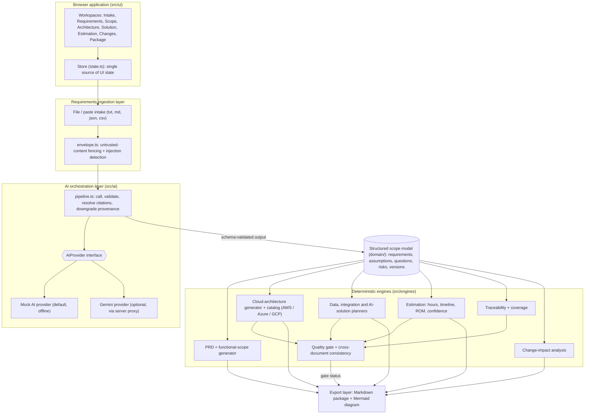

# Submission architecture

Data flows top to bottom. Models only ever propose; validation, estimation, coverage, impact and quality checks are deterministic code.

```mermaid
flowchart TB
  subgraph Browser["Browser application (src/ui)"]
    UI["Workspaces: Intake, Requirements, Scope, Architecture, Solution, Estimation, Changes, Package"]
    Store["Store (state.ts): single source of UI state"]
  end
  subgraph Ingest["Requirements-ingestion layer"]
    Upload["File / paste intake (txt, md, json, csv)"]
    Env["envelope.ts: untrusted-content fencing + injection detection"]
  end
  subgraph AI["AI orchestration layer (src/ai)"]
    Pipe["pipeline.ts: call, validate, resolve citations, downgrade provenance"]
    Prov{{"AiProvider interface"}}
    Mock["Mock AI provider (default, offline)"]
    Live["Gemini provider (optional, via server proxy)"]
  end
  Model[("Structured scope model (domain/): requirements, assumptions, questions, risks, versions")]
  subgraph Engines["Deterministic engines (src/engines)"]
    PRD["PRD + functional-scope generator"]
    Cloud["Cloud-architecture generator + catalog (AWS / Azure / GCP)"]
    Data["Data, integration and AI-solution planners"]
    Est["Estimation: hours, timeline, ROM, confidence"]
    Trace["Traceability + coverage"]
    Impact["Change-impact analysis"]
    QG["Quality gate + cross-document consistency"]
  end
  Export["Export layer: Markdown package + Mermaid diagram"]
  UI --> Store --> Upload --> Env --> Pipe
  Pipe --> Prov
  Prov --> Mock
  Prov --> Live
  Pipe -->|"schema-validated output"| Model
  Model --> PRD & Cloud & Data & Est
  Model --> Trace --> QG
  Model --> Impact
  Est --> QG
  Cloud --> QG
  Data --> QG
  PRD --> Export
  Cloud --> Export
  Data --> Export
  Est --> Export
  QG -->|"gate status"| Export
  Impact --> Export
```
